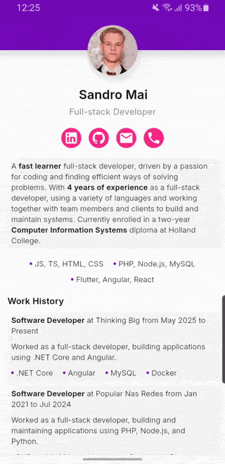

# Flutter Resume App

An interactive resume built with Flutter, including a collapsible header and full (edge-to-edge) control over the UI. Developed with a focus on smooth animations and consistency across devices.

## Preview

  

## Features

- **Custom Snapping Header**: A high-performance scroll animation.
- **Edge-to-Edge Design**: Full control over System UI (Status & Navigation bars) across Android and iOS.

## Technical Challenges

### Status & Navigation bars consistency

One major challenge was ensuring the status and navigation bar stay consistent across different devices, as transparency is handled differently between iOS and Android (and even across older Android versions). I solved this by implementing the system UI in two layers:
1. **System Layer**: Using `AnnotatedRegion` to explicitly tell the OS to use a specific background color.
2. **App Layer**: Building a custom layout that injects a `ColoredBox` into the system padding areas, ensuring consistency across all devices.

### Custom Snapping Header animations

Achieving fluid transitions for the header was a complex task due to the multiple interconnected elements (scrolling, animations, snapping). I achieved the desired result by implementing a custom `SliverPersistentHeaderDelegate` with scroll listeners to handle the snapping logic and `lerpDouble` to calculate smooth transitions between the expanded and collapsed states.

## License

This project is licensed under the MIT License - see the [LICENSE](LICENSE) file for details.
